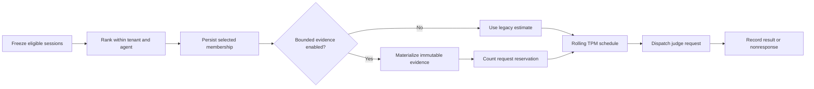
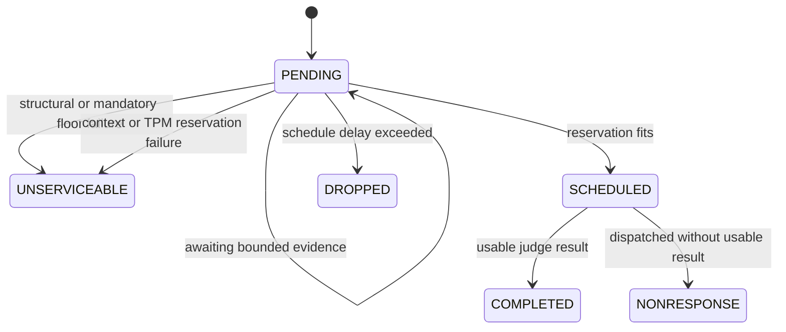

# Agent-Uniform Sampling With Bounded Evidence

Status: Python reference implementation

Audience: engineers implementing equivalent behavior in a production evaluation service

## Decision

Use deterministic simple random sampling without replacement inside each `(tenant_id, agent_id)` stratum. Freeze and persist membership before considering session length or token cost. For selected sessions, optionally construct one deterministic token-bounded evidence packet, reserve the complete request budget, and pace dispatch under a rolling tokens-per-minute limit.

This replaces token-constrained membership packing. It does not replace the selected session when materialization, scheduling, or judging fails.

## Goals

- Preserve equal inclusion probability within each agent population.
- Prevent long-session cost from influencing membership.
- Convert most context-oversized sessions into bounded judgeable evidence.
- Keep every transformation deterministic, versioned, and auditable.
- Distinguish pre-dispatch unserviceability from post-dispatch judge nonresponse.
- Support flag-off compatibility and a staged production rollout.

## Non-Goals

- Fleet-wide aggregation across agents.
- Outcome-aware, novelty-aware, or token-cost-aware membership.
- LLM summarization before judging.
- Splitting one selected session into multiple independent evaluations.
- Treating the reference JSON queue as production storage.

## End-to-End Contract



### Eligibility And Identity

A candidate is identified by:

```text
tenant_id / agent_id / session_id / session_version
```

The session version is part of deduplication and request identity. Changing content must produce a new version rather than mutating an existing selected record.

### Deterministic Membership

For seed `s` and candidate `c`, the Python reference computes lowercase SHA-256 hex over UTF-8:

```text
s || tenant_id || agent_id || session_id || session_version
```

where the literal delimiter is `||`. Candidates are sorted by rank hash, then session ID and session version. The first `min(n, N)` candidates are selected.

The following must never enter rank construction:

- estimated or actual tokens;
- session text or tool output;
- evidence truncation status;
- judge result or failure status;
- queue age or expected scheduling delay.

For stratum $a$:

$$
p_a = \frac{n_a}{N_a}.
$$

Persist `N_a`, `n_a`, `p_a`, seed, selected IDs, and rank hashes before materialization.

## Bounded Evidence

Bounded evidence is controlled by `BoundedEvidenceConfig.enabled` and defaults to false. Enabling it must create a new queue/run configuration epoch; an existing run must not reinterpret previously scheduled requests under a new evidence policy.

The implementation reuses `trace_sampling.token_representation` policy `complete_session_evidence_weighted_token_truncate`, version `3.0`.

### Evidence Allocation

| Evidence category | Mandatory when present | Weight |
|---|---:|---:|
| Final assistant outcome | Yes | 8 |
| Tool result | Yes | 7 |
| System context | Yes | 6 |
| Initial user goal | Yes | 4 |
| Later user refinement | Yes | 3 |
| Tool arguments | No | 2 |
| Earlier assistant content | No | 2 |

If the full canonical representation fits, it is unchanged. Otherwise variable content is cleared, each mandatory segment receives a minimum prefix, and remaining capacity is distributed deterministically by weight. Later tool results win tool-result ties. Canonical structure and event order remain present.

Changing schema, normalization, weights, floors, ordering, tokenizer identity, or prompt contract requires a new policy/configuration version.

### Reservation Formula

The reference prototype uses a configured prompt-overhead count:

$$
R = T_{evidence} + T_{prompt\ overhead} + T_{completion\ reserve}.
$$

A production implementation should build the exact provider request first and count its serialized input envelope:

$$
R = T(SerializeRequest(Evidence, Prompt, Schema)) + T_{completion\ reserve}.
$$

A request is serviceable only when:

$$
R \le T_{context}
$$

and

$$
R \le T_{TPM}.
$$

Equality is allowed. Use one tokenizer/accounting basis for evidence, prompt, context, and TPM. Persist model, resolved tokenizer encoding, tokenizer version, evidence policy, prompt fingerprint, and completion reserve.

## State And Failure Semantics



Reason codes in the Python reference:

- `AWAITING_BOUNDED_EVIDENCE`
- `MANDATORY_EVIDENCE_FLOOR_UNSERVICEABLE`
- `CANONICAL_STRUCTURE_UNSERVICEABLE`
- `RESERVATION_EXCEEDS_CONTEXT_WINDOW`
- `RESERVATION_EXCEEDS_TPM`
- `EVIDENCE_MATERIALIZATION_ERROR`
- `ESTIMATED_TOKENS_EXCEEDS_TPM` for the legacy flag-off path
- `MAX_SCHEDULE_DELAY_EXCEEDED`

Production code should use typed error codes rather than parsing exception messages. Classify tokenizer/service/storage failures as retryable or terminal explicitly.

## Persistence Contract

The reference queue schema is `agent-uniform-v2`. A production record should separate:

- `SamplingRun`: stratum, seed, population, sample size, inclusion probability, configuration epoch.
- `SelectedRequest`: immutable selected identity and rank.
- `EvidenceArtifact`: canonical payload or governed blob reference, hash, policy, tokenizer, source/config hashes, truncation audit.
- `TokenReservation`: input estimate, completion reserve, total, context/TPM limits.
- `ExecutionAttempt`: lease/ETag, scheduled and dispatched timestamps, retry count, provider request identity.
- `EvaluationResult`: score, status, actual usage, provider metadata.
- `StateTransition`: previous/new states, reason, timestamp, worker identity.

Evidence must be immutable after scheduling. Retries resend the same evidence hash. A changed evidence policy creates a new evaluation identity; it is not an ordinary retry.

## Scheduling

The Python scheduler demonstrates a deterministic rolling 60-second window. A production distributed implementation must atomically reserve capacity, prevent concurrent oversubscription, expire abandoned leases, and reconcile estimated with provider-reported actual usage. Reactive 429 retries do not replace proactive reservation.

## Reporting

Always publish, per agent:

- eligible population and selected count;
- inclusion probability;
- evidence-ready, scheduled, completed, unserviceable, dropped, and nonresponse counts;
- response rate;
- truncation rate and token-reduction distribution;
- mean score among completed selected sessions.

The Python reference suppresses its finite-population interval whenever `completed_count < selected_count`. The original sampling design does not make context failures, delay drops, or judge failures random. Do not present a probability-sampling confidence interval without a defensible nonresponse policy.

## Security And Privacy

The bounded packet contains user messages, assistant output, tool arguments, and tool results. Treat it as tenant content:

- encrypt at rest and in transit;
- preserve tenant isolation and regional requirements;
- use least-privilege access and audited reads;
- do not emit packet content in logs or metric dimensions;
- propagate source deletion and retention policy;
- version redaction before hashing if redaction is required;
- treat session content as untrusted prompt-injection input to the judge.

## Feature-Flag Rollout

1. **Off:** preserve current scheduling behavior.
2. **Shadow materialization:** build packets and reservations without changing dispatch; compare estimates and failure rates.
3. **Allowlisted bounded dispatch:** enable for selected tenants/agents using a new run epoch.
4. **Broaden:** monitor response rate, truncation, estimate error, TPM violations, score shift, and stuck pending items.
5. **Rollback:** stop creating bounded epochs; never reinterpret already scheduled artifacts.

Halt rollout on hash instability, context/TPM violations, materialization failure spikes, material response-rate changes, or unacceptable score disagreement between full and bounded evidence.

## Acceptance Criteria

- Membership is identical when only token cost or session length changes.
- Per-stratum inclusion probability is exactly `min(n, N) / N`.
- Flag-off behavior remains compatible.
- Flag-on scheduling refuses unmaterialized items.
- A raw oversized selected session can become serviceable after deterministic bounding.
- Canonical evidence and hash survive process reload.
- Every scheduled reservation fits context and TPM limits.
- Mandatory-floor and structural-floor failures remain selected and explicit.
- No failure causes replacement membership.
- Partial response suppresses probability-sampling intervals.
- No evidence content appears in logs.
