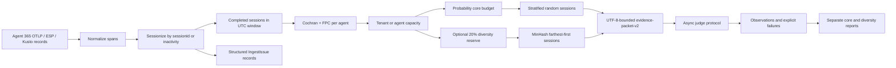

# Alternative Agent 365 Session Evaluation Sampling

Date: 2026-07-28

Status: implemented prototype on `stangoodwin/trace-sampling-alt`

Package: `trace_sampling_alt`

## 1. Decision

Build the alternative pipeline as a scheduled evaluation library over completed
Agent 365 sessions reconstructed from OpenTelemetry data. This is a batch
statistical sampler based on `eval-sampling-poc`; it is not the online
backpressure sampler in `trace_sampling`.

The sampling unit is one Agent 365 session. A tenant-scoped `sessionId` is
authoritative when present. If it is absent, spans in one conversation are split
into time-bound sessions after more than 30 minutes of inactivity by default.

Each run evaluates sessions completed in one half-open schedule window. The
default is the previous completed 24-hour UTC interval. A one-hour duration uses
the previous completed UTC hour. Explicit windows support deterministic replay
and backfill.

Cochran plus finite-population correction (FPC) determines a total evaluation
budget independently for every agent in the window. When diversity is enabled,
20% of that total budget is reserved for MinHash farthest-first selection and
80% remains a probability sample. Diversity is not an additional 20%.

Task Completion is the initial LLM-as-a-Judge metric. It is a binary,
session-level pass/fail value. The package includes a deterministic judge stub;
a future CAPI or Foundry implementation plugs into the same provider-neutral
judge protocol.

## 2. Goals

1. Ingest observed Microsoft Agent 365 OTLP, ESP, and Kusto trace shapes.
2. Reconstruct tenant-scoped Agent 365 sessions.
3. Run over completed UTC-aligned windows, daily by default and configurable.
4. Plan a representative per-agent sample from that window's eligible sessions.
5. Respect optional tenant- or agent-level evaluation capacity.
6. Reserve optional diversity inside the total budget.
7. Use MinHash farthest-first over task, response, and tool evidence.
8. Convert long sessions into deterministic UTF-8-bounded evidence packets.
9. Make judge execution bounded, retryable, idempotent, and auditable.
10. Report core and diversity results separately with explicit missingness.
11. Preserve Likert, scalar, and categorical metric values for future evaluators.

## 3. Non-goals

- Streaming or tail-sampling active sessions.
- An in-process scheduler or daemon; an external scheduler invokes the library.
- Queue backpressure or online keep/drop decisions.
- A concrete CAPI, Foundry, Cosmos DB, or Maven integration.
- LLM summarization as part of long-session compression.
- Judge calibration or production quality claims for the deterministic stub.
- Imputation of unevaluated sessions.
- HT/Hajek or nonresponse-adjusted estimation in this first implementation.

## 4. End-to-End Flow



`AlternativeSamplingPipeline.run(...)` returns every stage in one `PipelineRun`:
normalization results, the sample manifest, evaluation results, and the report.
No stage uses process-global mutable state.

## 5. Sessionization

### 5.1 Accepted source shapes

The normalizer accepts:

1. OTLP envelopes under
   `traceRequest.resourceSpans[].scopeSpans[].spans[]`;
2. ESP documents under `documents[].jsonContent`; and
3. Kusto-style rows with PascalCase fields.

OTLP attributes can be a typed map or `{key, value}` list. ESP values may
already be flattened. Message bodies can be a bare list, a `{messages: [...]}`
wrapper, `{role, content}`, or `{role, parts}`.

### 5.2 Identity aliases

| Concept | Accepted fields |
|---|---|
| Tenant | `microsoft.tenant.id`, `tenant.id`, `TenantId` |
| Agent | `gen_ai.agent.id`, `AgentId` |
| Session | `microsoft.session.id`, `session_id`, `SessionIdentity` |
| Conversation | `gen_ai.conversation.id`, `ConversationId` |
| Channel | `microsoft.channel.name`, `gen_ai.execution.source.name`, `ChannelName` |

Tenant and agent are mandatory. At least one of session or conversation identity
must be present.

### 5.3 Authoritative session IDs

Spans with a session ID are grouped by:

```text
(tenant_id, agent_id, session_id)
```

One session may contain several conversation IDs, and one conversation may
contain several session IDs. The normalized `unit_id` hashes tenant, agent, and
session identity, so reuse of a source session ID across tenants or agents does
not collide.

### 5.4 Inactivity fallback

Without a session ID, spans are grouped by tenant, agent, and conversation, then
ordered deterministically. A new session begins only when:

```text
next_start > previous_activity_end + inactivity_timeout
```

The default timeout is 30 minutes. Exactly 30 minutes remains in the same
session. Missing timestamps form a deterministic fallback segment and emit a
`fallback_sessionization_uncertainty` issue.

### 5.5 Eligibility and completion

A judgeable session needs user text and a final assistant response. Malformed,
unidentified, or incomplete sessions become structured issues instead of being
silently dropped.

An explicit end timestamp is the preferred completion time. If absent, the
latest event start is used and `session_completion_inferred` is recorded. A
session with no usable completion timestamp cannot enter a window.

## 6. Evaluation Windows

`EvaluationWindow` uses half-open bounds:

```text
[start_at, end_at)
```

A session belongs to the window containing its completion time. Sessions ending
exactly at `end_at` belong to the next window.

`AlternativeSamplingPipeline.window_duration` defaults to 24 hours. When no
explicit window or end is supplied, the pipeline uses the most recently
completed UTC-aligned interval:

- 24 hours: previous UTC calendar day;
- 1 hour: previous completed UTC hour;
- another positive duration: previous epoch-aligned interval of that duration.

Callers can pass `window_end` or an explicit `EvaluationWindow` for deterministic
replay and backfill. The resolved bounds participate in the sample run ID.

An external scheduler remains responsible for invoking the pipeline once per
day, once per hour, or at another cadence.

## 7. Statistical Planning

### 7.1 Per-agent population

For every agent, the population $N$ is the number of completed, eligible
sessions attributed to that evaluation window. Cochran/FPC is run independently
for each agent on every window.

For margin $E$, confidence critical value $z$, and conservative expected pass
rate $p=0.5$:

$$
n_0 = \left\lceil \frac{z^2p(1-p)}{E^2} \right\rceil.
$$

The finite-population recommendation is:

$$
n = \min\left(N,\left\lceil
\frac{n_0}{1 + (n_0-1)/N}
\right\rceil\right).
$$

At 95% confidence and a 10 percentage-point margin, $n_0=97$. If one agent has
$N=300$ eligible sessions in the day, FPC recommends 74 total evaluations.

Low-volume populations become censuses.

### 7.2 Capacity

Optional agent capacity caps the recommendation directly. Optional tenant
capacity is allocated proportionately across per-agent statistical
recommendations using capped Hamilton allocation. Tenant and agent capacity
modes are mutually exclusive in one run.

Capacity is a total evaluation budget. The manifest records granted,
statistically recommended, selected, unused, and precision status. Surplus is
left unused.

## 8. Core and Diversity Budget

### 8.1 Inside-budget split

Let $B$ be the selected total after Cochran/FPC and capacity. With diversity
enabled:

$$
n_{diversity}=\operatorname{round}_{half\ up}(0.20B),
\qquad n_{core}=B-n_{diversity}.
$$

The split is configurable through `diversity_fraction`, whose default is 0.20.
At least one core unit is retained when $B>0$. A census skips the split and
selects every session as core.

For $N=300$, $B=74$ becomes:

```text
59 probability-core sessions + 15 diversity sessions = 74 total
```

This means the probability sample is smaller than the sample size calculated
for the requested margin. The plan records
`diversity_reserved_precision_shortfall`, and the report exposes an
informational note. The run is not marked partial solely because diversity was
enabled.

### 8.2 Probability core

Sessions are stratified by:

```text
(turn_count_band, channel)
```

Turn bands are `1`, `2-3`, `4-7`, `8-15`, and `16+`. Multi-channel sessions use
`multi`; missing channel uses `unknown`.

The core count is allocated proportionately across strata with capped Hamilton
allocation, then sampled uniformly without replacement. Every core record
persists $N_h$, $n_h$, inclusion probability $\pi_i=n_h/N_h$, and sampling
weight $1/\pi_i$.

Core units are `estimand_eligible=True`.

### 8.3 MinHash diversity

Every non-core session is a diversity candidate. There is no error-only
restriction.

Each session receives a deterministic MinHash signature over case-folded,
field-tagged word n-grams from:

- user queries;
- assistant/LLM responses;
- tool names;
- tool inputs; and
- tool outputs.

Defaults are 3-grams and 128 deterministic universal-hash permutations. Policy
version, seed, n-gram size, and permutation count scope the signature.

Farthest-first initializes every candidate's distance against all core
signatures. It chooses the farthest candidate, updates distances against that
selection, and repeats. Therefore diversity fills coverage gaps relative to
both the probability sample and already-selected diversity sessions.

Diversity units are `estimand_eligible=False`, carry no inclusion probability or
sampling weight, and cannot alter the headline estimate.

## 9. Long-Session Evidence

The judge never receives a raw trace object. `build_evidence_packet(...)`
produces deterministic `evidence-packet-v2` canonical JSON:

```text
{
  version,
  scope: {
    tenant_id, agent_id, unit_id, session_id,
    conversation_ids, sessionization_kind
  },
  trace_ids,
  timing: {started_at, ended_at, had_error},
  turns: [{original_index, user, assistant}],
  tool_calls: [{original_index, name, input, output, status}],
  audit: {
    truncation_policy, version,
    original/emitted/omitted turn counts,
    original/emitted/omitted tool counts
  }
}
```

If the full session fits the byte limit, every turn and tool call is emitted.
For an oversized session, the builder:

1. retains structured slots for the first and final turns;
2. retains the latest tool call when tools exist;
3. preserves bounded evidence from the first user task, final assistant outcome,
   latest tool name, and latest tool output;
4. adds middle turns/tools only while they fit; and
5. truncates text at valid UTF-8 code-point boundaries.

Every growth attempt serializes the complete packet, so JSON escaping counts
toward the byte limit. The packet records SHA-256, original and emitted bytes,
truncation state, and exact omitted-object counts.

If the structural floor or mandatory task/outcome evidence cannot fit, evidence
construction fails explicitly before the judge call. This is deterministic
extractive truncation, not LLM summarization and not a claim of semantic
equivalence to full context.

## 10. Metrics and Judge Contract

`TASK_COMPLETION_V1` is binary at session level. Future value kinds are retained
without silent coercion:

| Kind | Report |
|---|---|
| Binary | passes, failures, rate, Wilson/FPC interval |
| Likert | ordinal distribution and mean |
| Scalar | count, mean, minimum, maximum |
| Categorical | category counts |

Every metric summary includes selected, submitted, succeeded, failed, and
response-rate counts.

The provider contract is:

```python
class AsyncJudge(Protocol):
    descriptor: JudgeDescriptor

    async def evaluate(self, request: JudgeRequest) -> JudgeResponse:
        ...
```

`JudgeRequest` contains scoped session identity, metric specification, stable
idempotency identifiers, and the bounded evidence packet. A synchronous provider
can use `SyncJudgeAdapter`.

The included deterministic stub is test scaffolding, not a quality signal. A
CAPI or Foundry adapter owns provider authentication, request construction,
response parsing, and exception classification.

## 11. Evaluation and Failure Semantics

The runner creates one request for each `(sampled session, metric)` pair. The
idempotency material includes:

- sample run and policy version;
- tenant, agent, and stable session unit ID;
- core or diversity sample kind;
- metric ID and version;
- evidence digest; and
- judge provider, name, and version.

Execution has bounded concurrency, per-call timeout, and exponential backoff.
Only explicit transient errors and timeouts retry. Malformed and unexpected
provider responses fail that request without aborting the batch.

Selected sessions are never replaced after judge failure. A failure is missing
outcome data, not a Task Completion failure.

## 12. Reporting

Core and diversity results are grouped separately by tenant-scoped agent,
metric, version, and sample kind.

Binary core reporting contains:

- selected, submitted, succeeded, and judge-failed counts;
- passes and outcome failures;
- response rate;
- pass rate over successful judge responses; and
- Wilson interval with FPC against the eligible session population.

Diversity summaries are descriptive and have no population CI. Diversity
outcomes never affect the core headline.

Judge nonresponse creates a warning and partial status. A normal diversity
reserve creates an informational note but does not degrade run status.

### 12.1 Statistical boundary

The current core point estimate is an unweighted session mean. Under the
implemented proportionate stratum allocation, this is the intended
self-weighting prototype estimator. Inclusion probabilities remain in the
manifest.

Before production enables disproportionate allocation, response adjustment,
zero-probability strata, or cross-agent tenant estimates, reporting must add an
HT/Hajek or post-stratified estimator with design-appropriate variance.
Judge nonresponse also needs a publication or adjustment policy; larger samples
do not remove missing-not-at-random bias.

## 13. Public Usage

```python
from datetime import timedelta

from trace_sampling_alt import (
    AlternativeSamplingPipeline,
    DeterministicJudgeStub,
    SamplePolicy,
)

pipeline = AlternativeSamplingPipeline(
    judge=DeterministicJudgeStub(),
    sample_policy=SamplePolicy(diversity_enabled=True),
    window_duration=timedelta(hours=24),
)

run = await pipeline.run(
    records,
    tenant_capacities={"tenant-id": 200},
)
```

For an hourly run, set `window_duration=timedelta(hours=1)`. For exact replay or
backfill, pass `evaluation_window=` or `window_end=`.

## 14. Privacy and Security

- Raw span blobs are not sent to the judge.
- User IDs and email fields are not copied into normalized units or evidence.
- Judge reasoning is length-bounded and receives basic email/user-ID redaction.
- User/assistant content and relevant tool inputs/outputs are intentionally sent
  because Task Completion requires task and outcome evidence.
- Production adapters must apply Agent 365 retention, tenant isolation, regional
  data handling, access control, and secret-management requirements.
- Unexpected provider exception text is not persisted verbatim.

## 15. Validation

Focused and end-to-end tests cover:

- OTLP, ESP, and Kusto normalization;
- authoritative session IDs and 30-minute inactivity fallback;
- cross-tenant/agent session-ID scoping;
- inferred completion and half-open windows;
- default daily and configurable hourly aligned windows;
- per-agent Cochran/FPC populations after window filtering;
- capacity conservation and exact 80/20 total-budget splits;
- census behavior;
- tagged n-gram MinHash sensitivity across all required fields;
- farthest-first spread against duplicate outliers;
- deterministic replay and core/diversity separation;
- structural UTF-8 evidence truncation over hundreds of turns/tools;
- judge retries, failures, and idempotent storage;
- core Wilson/FPC reporting and native non-binary summaries; and
- end-to-end orchestration.

The complete repository suite passed with 213 tests and 2 opt-in live-Azure
tests skipped before the final documentation update.

## 16. Known Limitations and Production Follow-ups

1. Implement and calibrate a real Task Completion judge through CAPI or Foundry.
2. Connect the completed-session frame and UTC window watermark to the production scheduler.
3. Ensure source queries include enough lookback to reconstruct sessions crossing a window boundary.
4. Add immutable window revisions and delayed-telemetry backfills.
5. Add durable tenant-partitioned manifest, attempt, observation, and report storage.
6. Validate concrete `execute_tool`, guardrail, and sub-agent span schemas; local captures confirmed invoke/inference shapes only.
7. Calibrate long-session truncation against full-context labels and add alternate routing for packets below an evidence-sufficiency threshold.
8. Add judge calibration, gold-set alignment, drift monitoring, and release gates.
9. Define missing-response publication thresholds and any weighting adjustment.
10. Add design-weighted reporting before disproportionate allocation.

## 17. Relationship to `trace_sampling`

| Package | Decision mode | Unit | Primary goal |
|---|---|---|---|
| `trace_sampling` | online keep/drop | arriving trace | preserve variety under backpressure |
| `trace_sampling_alt` | scheduled batch sample/evaluate | completed session | estimate per-window quality under a fixed judge budget |

The packages can coexist, but their algorithms and estimands must not be mixed.
Reusable patterns include immutable models, bounded canonical evidence,
deterministic seeds, injected providers, explicit failures, and curated APIs.
